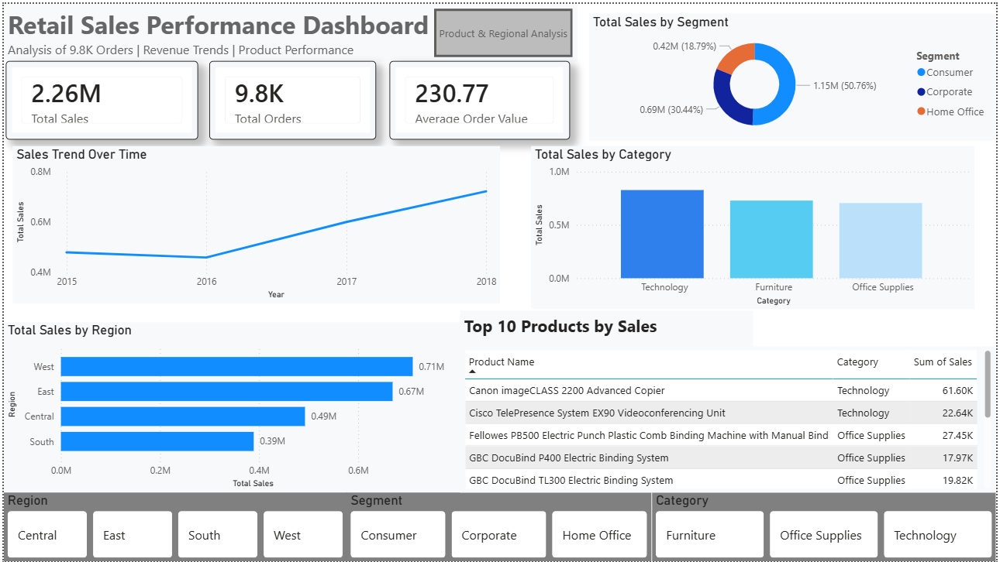
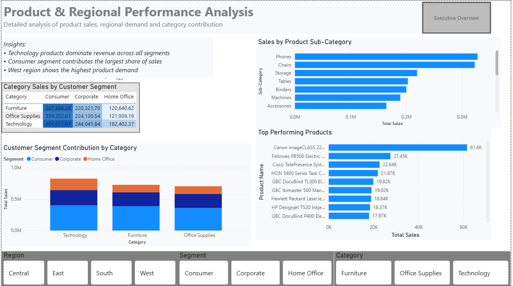

# Retail Sales Performance Dashboard (Power BI)

## Overview
This project presents an interactive Power BI dashboard analyzing retail sales performance across regions, categories, and customer segments.

The report explores 9.8K retail orders generating $2.26M in revenue.

## Dashboard Pages

### Executive Overview
Provides a high-level summary of sales performance including:
- Total Sales
- Total Orders
- Average Order Value
- Sales trends over time
- Regional sales comparison
- Category sales distribution
- Top products by revenue

---

### Product & Regional Analysis
Provides deeper insights into product performance and customer segments.

Key analysis includes:
- Sales by product sub-category
- Category performance by customer segment
- Top performing products
- Segment contribution to category revenue

---

## Key Insights
- West region generates the highest revenue (~$0.71M)
- Technology category contributes the largest share of sales
- Consumer segment accounts for ~50% of total revenue
- Phones and Chairs are top-performing product subcategories

---

## Tools Used
- Power BI
- Power Query
- DAX
- Data Visualization

---

## Dataset
Superstore Sales Dataset containing 9.8K retail transactions.

---
## Live Dashboard
View the interactive report here:

https://app.powerbi.com/view?r=eyJrIjoiMDZjODExNjQtYTFmMi00NjZjLWE5ZmYtOGQ5NjY5ZmY3YTFlIiwidCI6ImM2ZTU0OWIzLTVmNDUtNDAzMi1hYWU5LWQ0MjQ0ZGM1YjJjNCJ9&pageName=7ae4bf10240c651040d9
